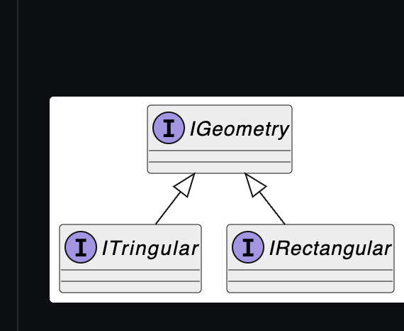
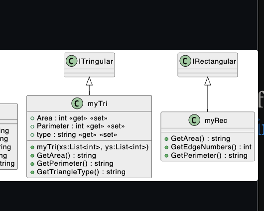
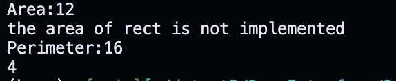
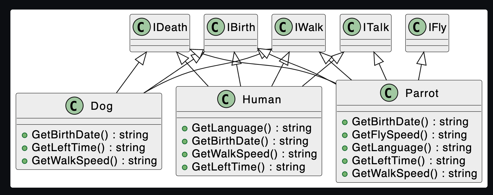

---
CJKmainfont: Source Han Serif SC
CJKoptions: AutoFakeBold
mainfont: Source Han Serif SC
---


```cs
var tir=new myTri();
var rect=new myRec();
System.Console.WriteLine(tir.GetArea());
System.Console.WriteLine(rect.GetArea());
System.Console.WriteLine(tir.GetPerimeter());
System.Console.WriteLine(rect.GetEdgeNumbers());

```


```cs
public class myTri : ITringular
{
    public int Area { get; set; }
    public int Parimeter { get; set; }
    public string type { get; set; }
    static double CalculateDistance(double x1, double y1, double x2, double y2)
    {
        return Math.Sqrt(Math.Pow(x2 - x1, 2) + Math.Pow(y2 - y1, 2));
    }

    public myTri(List<int> xs,List<int> ys){
        
        
        double x1 = 1.0;
        double y1 = 2.0;
        double x2 = 4.0;
        double y2 = 6.0;
        double x3 = 7.0;
        double y3 = 2.0;

        double distance1 = CalculateDistance(x1, y1, x2, y2);
        double distance2 = CalculateDistance(x2, y2, x3, y3);
        double distance3 = CalculateDistance(x3, y3, x1, y1);

        double Perimeter = distance1 + distance2 + distance3;
        double s = Perimeter / 2; // Semi-perimeter
        double Area = Math.Sqrt(s * (s - distance1) * (s - distance2) * (s - distance3));

    }
    public string GetArea()
    {
        return Area.ToString();
    }

    public string GetPerimeter()
    {
        return Parimeter.ToString();
    }

    public string GetTriangleType()
    {
        return "obtuse angle";
    }
}
public class myRec : IRectangular
{
    public string GetArea()
    {
        return "the area";
    }

    public int GetEdgeNumbers()
    {
        return 4;
    }

    public string GetPerimeter()
    {
        return "the perimeter";
    }
}

```

----

```cs
using System;
using System.Collections.Generic;
using System.Linq;
using System.Text;
using System.Threading.Tasks;

namespace DemoInterface
{
    public interface IBirth
    {
        string GetBirthDate();
    }
    public interface IWalk
    {
        string GetWalkSpeed();
    }

    public interface ITalk
    {
        string GetLanguage();
    }
    public interface IFly
    {
        string GetFlySpeed();
    }
    public interface IDeath
    {
        string GetLeftTime();
    }


}
```


```cs
using System.Runtime.InteropServices;
using DemoInterface;

Console.WriteLine("Hello, World!");
Human human = new Human();
Dog dog = new Dog();  
Parrot parrot = new Parrot();
System.Console.WriteLine(human.GetLanguage());
System.Console.WriteLine(dog.GetWalkSpeed());
System.Console.WriteLine(parrot.GetFlySpeed());

public class Human:ITalk,IWalk,IDeath,IBirth
{
    public string GetLanguage()
    {
        return "it's People's language";
    }


    public string GetBirthDate()
    {
        return "the birth Date is xxx";
    }

    public string GetWalkSpeed()
    {
        return "the walking speed is ";
    }

    public string GetLeftTime()
    {
        return "congrats, you dont have much time left";
    }


}
public class Dog : IBirth, IWalk, IDeath
{
    public string GetBirthDate()
    {
        return "what? the dog was born a year ago";
    }

    public string GetLeftTime()
    {
        return "dog can really live long";
    }

    public string GetWalkSpeed()
    {
        return "the dog is walking, or more like running?";
    }
}
public class Parrot : IBirth, IFly, ITalk, IDeath, IWalk
{
    public string GetBirthDate()
    {
        return "this P is born in 2020";
    }

    public string GetFlySpeed()
    {
        return "Parrot can fly, indeed";
    }

    public string GetLanguage()
    {
        return " you are just mocking people";
    }

    public string GetLeftTime()
    {
        return "Parrot can live for 80 years";
    }

    public string GetWalkSpeed()
    {
        return "Parrot can walk like 80mph";
    }
}
```