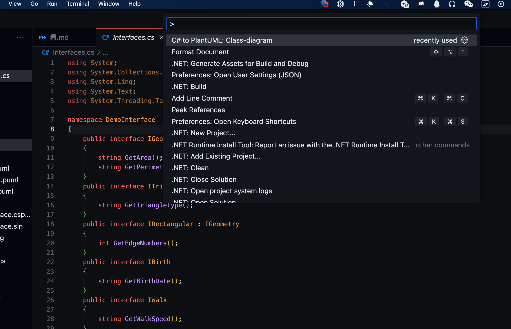
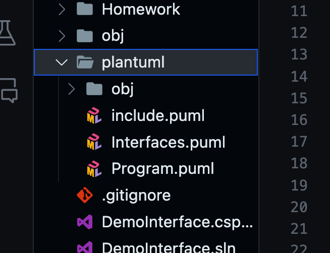

先写出一堆接口，
然后安装这个两个extension


注意CSharp to plantUML 要求.net core runtime
可以直接到官网下载
https://dotnet.microsoft.com/en-us/download


然后到接口的那个文件的界面按F1，
然后选择这个PlanteUML: Class-diagram


然后打开这个生成的Plantuml文件夹
中的相应的 .puml文件



在MacOs下如果不能preview 
需要在puml文件的第二行加入这个代码 
```
!pragma layout smetana
```


然后点击右上角的preview，即可展示接口
